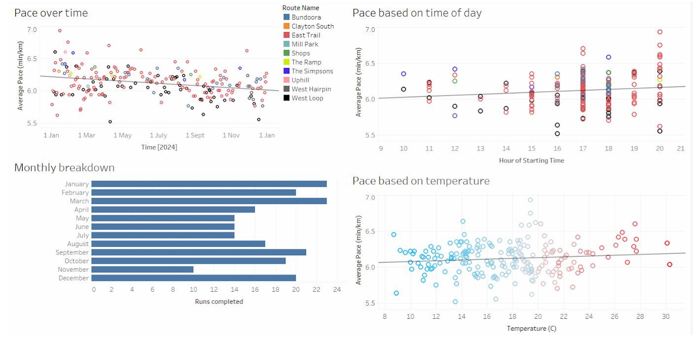
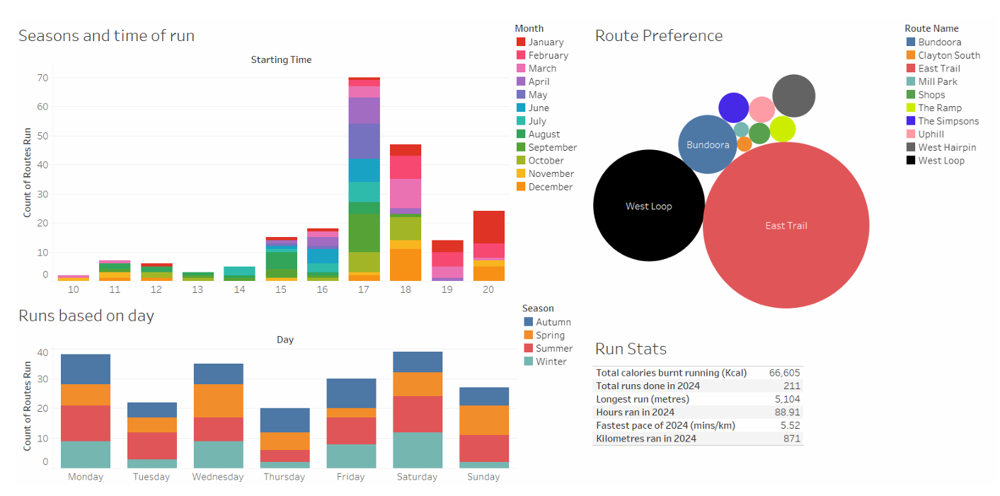

# Communicating Data Driven Insight
## COSC572 Management Information Systems - Assignment 3B
### By Kevin Teong

## My 2024 Running Data
https://public.tableau.com/app/profile/kevin.teong/viz/BoomyRun/2024Running

## Purpose
I decided to analyse my running statistics over 2024 to reflect on whether I have improved over the year and answer some of the questions I have about my own running performance. It was also a good opportunity for me to apply what I had learnt from this subject onto something that matters to me. The target audience would be myself, and perhaps anyone enthusiastic about running or data analytics.

The process of extracting my running data from my smartwatch provided an interesting challenge of using personal data and transforming it into something meaningful through data analysis and business intelligence tools. As part of any data project, I had to plan and design methods to cleanse the data to remove anomalous readings. I also employed data enrichment techniques via the use of a Python script using the Open Meteo API to add weather data to my run data.

## Analysis
The main focus of my visualisation was to analyse my running pace and the factors that impact it. On face value, the data looks noisy with no meaningful patterns visible at first glance. But as we strip away the noise and try to focus on variables independently, we can start to get a picture of the factors that are correlated with improved running performance.

Scatter plots are used extensively in this analysis as they provide a simple but intuitive representation of the relationship (or lack thereof) between two variables. Scatter plots can show trends (such as linear or exponential relationships), show variance within the data (such as outliers) and can be used with other statistical methods such as linear regression to quantify the strength of a relationship between two variables (Atlassian, n.d.). One issue with the scatter plot is overlapping data points (Weissgerber et al., 2019) which may give the impression that there are fewer data points than what actually exists; though the use of semi-transparent data points in this presentation can circumvent this issue somewhat.

Looking at the scatter plot data, there is a possible link between time and improvement in pace, though the relationship appears to be relatively weak. Assuming a linear relationship and using a linear regression model, the calculated R-squared value (0.08) suggests that time only explains a small portion of the variation in pace improvement. However, correlation is not evidence of causation (Atlassian, n.d.) and given the noise in the data, running pace is most likely influenced by other factors. Interestingly, there are very few studies that explore the hypothesis that running regularly improves running performance; most studies focus on other methods of improving running performance such as strength training (Blagrove, Howatson, & Hayes, 2017), interval training (Skovgaard et al., 2023) and sprint training (Koral et al., 2018). Intuitively and anecdotally, it seems like running regularly should improve running performance but the data shows that its impact on me is minimal at best.

The effect of temperature and time of day with running performance is also explored, however, the scatter plot shows that there is no significant relationship between these variables. Despite this, the knowledge that no relationship can still offer valuable insights. It can challenge preconceived notions or dispel myths that humans are naturally inclined to believe. For example, I initially hypothesised that I ran slower in very hot weather—an assumption based on how much more exhausted my body felt after running in the heat. However, the data reveals that the relationship between pace and temperature is extremely weak and not statistically significant (p-value 0.104 and R-squared value of 0.012). Similarly, I suspected that running late in the evening led to worse performance compared to running earlier in the day. Once again, the data suggests otherwise, showing no meaningful correlation (p-value 0.08 and R-squared value of 0.014). Interestingly, the current research shows that running performance has an optimal temperature range of around 10° C (El Helou et al., 2012) and optimal time of around 4 to 8PM (Mirizio et al., 2020); this highlights that a sample size of one is not sufficient to draw robust conclusions. These observations cannot be taken for scientific fact but they do highlight the importance of rigorous statistical analysis and the potential for misleading visual patterns in data presentation.

Bar graphs are used to make comparisons between different categories such as different time of day or different days of the week. This dataset shows that evening runs were by far the most frequent. The use of the segmented bar chart also shows that later evening runs between 19:00 and 21:00 occurred only in the summertime. Running frequency bar graph shows that winter months had fewer runs, with a notable dip in November coinciding with an illness. The days which had the highest running frequency (Mondays and Saturdays) coincided with my personal availability. Bar graphs are an effective and simple way to compare data between categories and identify trends.

Inherently, there are so many factors that can affect running performance; many which are difficult to quantify. Variables such as exhaustion levels, wind speed, road traffic, psychological state and caffeine levels might each have subtle effects, making it difficult to identify clear-cut relationships in the data. There are strong assumptions in using linear regression but yet, there's a certain beauty in the noise—reminding us that not everything is predetermined and that some aspects of performance simply cannot be fully explained by data science.

## Evaluation
Analysing the data using linear regression models and data visualisation provides us with insights that can help explain the factors that influence running performance, and this can guide our focus on how to improve running performance. While the data is not robust enough to perform predictive analysis, it is a good reminder that data in the real world is not perfect.

This project followed a classic knowledge management cycle: data collection (smartwatch), data preparation (CSV conversion, Python enrichment), data analysis and visualisation (Tableau), and knowledge dissemination. The analysis revealed that maintaining the current running regimen is unlikely to significantly improve performance. The data challenged some of my preconceived notions and made me gather knowledge from experts. The research conducted during this project provided valuable insights into effective running strategies (such as strength or interval training), which will guide future training decisions.

## References
1. Abraham, B., & Ledolter, J. (2006). Student solutions manual for Introduction to regression modeling. Thomson Brooks/Cole.
2. Atlassian. (n.d.). What is a scatter plot? Retrieved January 20, 2025, from https://www.atlassian.com/data/charts/what-is-a-scatter-plot
3. Blagrove, R. C., Howatson, G., & Hayes, P. R. (2017). Effects of strength training on the physiological determinants of middle- and long-distance running performance: A systematic review. Sports Medicine, 48(5), 1117–1149. https://doi.org/10.1007/s40279-017-0835-7
4. Cleveland, W. S. (1993). Visualizing data. Hobart press.
5. Mirizio, G. G., Nunes, R. S. M., Vargas, D. A., et al. (2020). Time-of-day effects on short-duration maximal exercise performance. Scientific Reports, 10, 9485. https://doi.org/10.1038/s41598-020-66342-w
6. El Helou, N., Tafflet, M., Berthelot, G., Tolaini, J., Marc, A., Guillaume, M., Hausswirth, C., & Toussaint, J.-F. (2012). Impact of environmental parameters on marathon running performance. PLoS ONE, 17(5), e37407. https://doi.org/10.1371/journal.pone.0037407
7. Ely, M. R., Cheuvront, S. N., Roberts, W. O., & Montain, S. J. (2007). Impact of weather on marathon-running performance. Medicine & Science in Sports & Exercise, 39(3), 487–493. https://doi.org/10.1249/mss.0b013e31802d3aba
8. Koral, J., Oranchuk, D. J., Herrera, R., & Millet, G. Y. (2018). Six sessions of sprint interval training improves running performance in trained athletes. Journal of Strength and Conditioning Research, 32(3), 617-623. https://doi.org/10.1519/JSC.0000000000002286
9. Skovgaard, C., Christiansen, D., Martínez‐Rodríguez, A., & Bangsbo, J. (2023). Similar improvements in 5-km performance and maximal oxygen uptake with submaximal and maximal 10-20-30 training in runners, but increase in muscle oxidative phosphorylation occur only with maximal effort training. Scandinavian Journal of Medicine & Science in Sports, https://doi.org/10.1111/sms.14493.
10. Weissgerber, T. L., Winham, S. J., Heinzen, E. P., Milin-Lazovic, J. S., Garcia-Valencia, O., Bukumiric, Z., Savic, M. D., Garovic, V. D., & Milic, N. M. (2019). Reveal, don't conceal: Transforming data visualization to improve transparency. Circulation, 140(18), 1506–1518. https://doi.org/10.1161/CIRCULATIONAHA.118.037777
